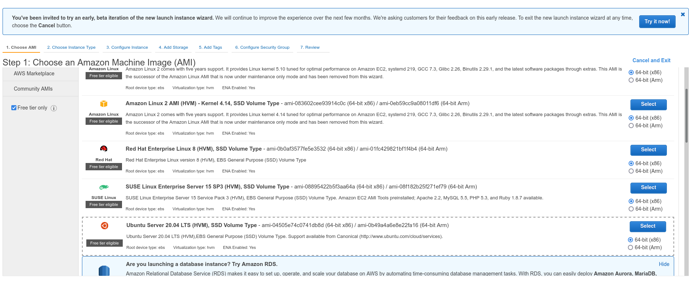
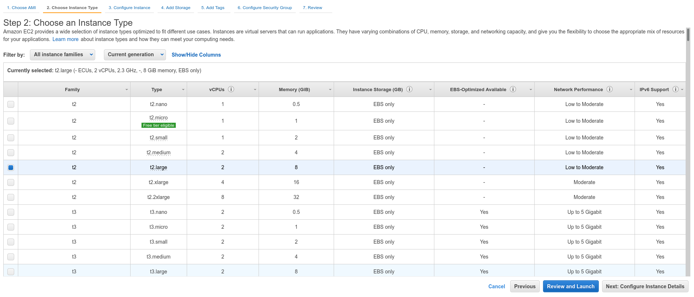
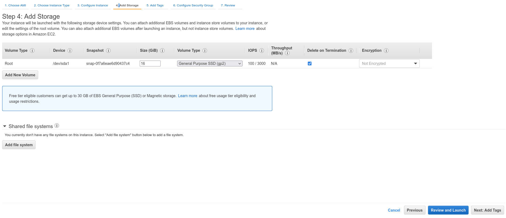
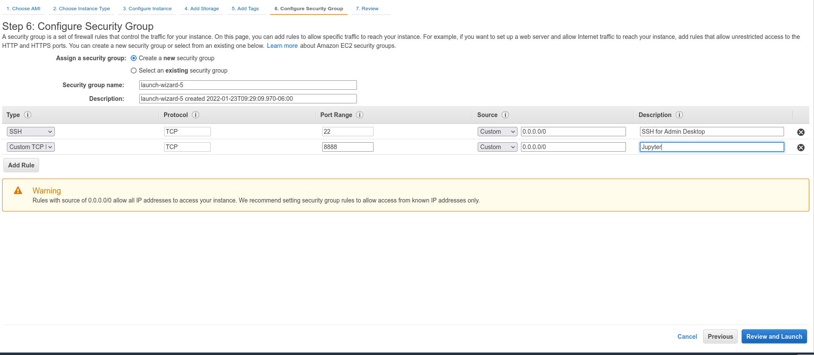

# Instructions to complete assignment 0

## Instance creation

- Use "Ubuntu Server 20.04 LTS" with type "t2.large", increase disk memory size to 16gb, and open port 8888 for jupyter









## Log into your instance
- ssh into your instance
```
ssh -i .ssh/insertYourKey.pem ubuntu@0.00.000.00
```

- If on linux/mac (if you are on windows and use putty, please consult the internet), if you get the following error when attempting to ssh in...
```sh
@@@@@@@@@@@@@@@@@@@@@@@@@@@@@@@@@@@@@@@@@@@@@@@@@@@@@@@@@@@
@         WARNING: UNPROTECTED PRIVATE KEY FILE!          @
@@@@@@@@@@@@@@@@@@@@@@@@@@@@@@@@@@@@@@@@@@@@@@@@@@@@@@@@@@@
Permissions 0644 for '.ssh/insertYourKey.pem' are too open.
It is required that your private key files are NOT accessible by others.
This private key will be ignored.
Load key ".ssh/insertYourKey.pem": bad permissions
ubuntu@0.00.000.00: Permission denied (publickey).
```

then you should run the command:

```sh
chmod 600 .ssh/insertYourKey.pem
```

and try again


## set up instance

```sh
sudo apt-get update
sudo apt install -y python3-pip python3.8-venv
python3 -m venv big_data_env
source big_data_env/bin/activate
pip install pandas pyarrow tqdm jupyter_http_over_ws
```

- add 16gb of swap space to the instance following the instructions [here](https://www.howtogeek.com/455981/how-to-create-a-swap-file-on-linux/)

- follow instructions [here](https://research.google.com/colaboratory/local-runtimes.html) to connect colab to your notebook instance

- run your code
